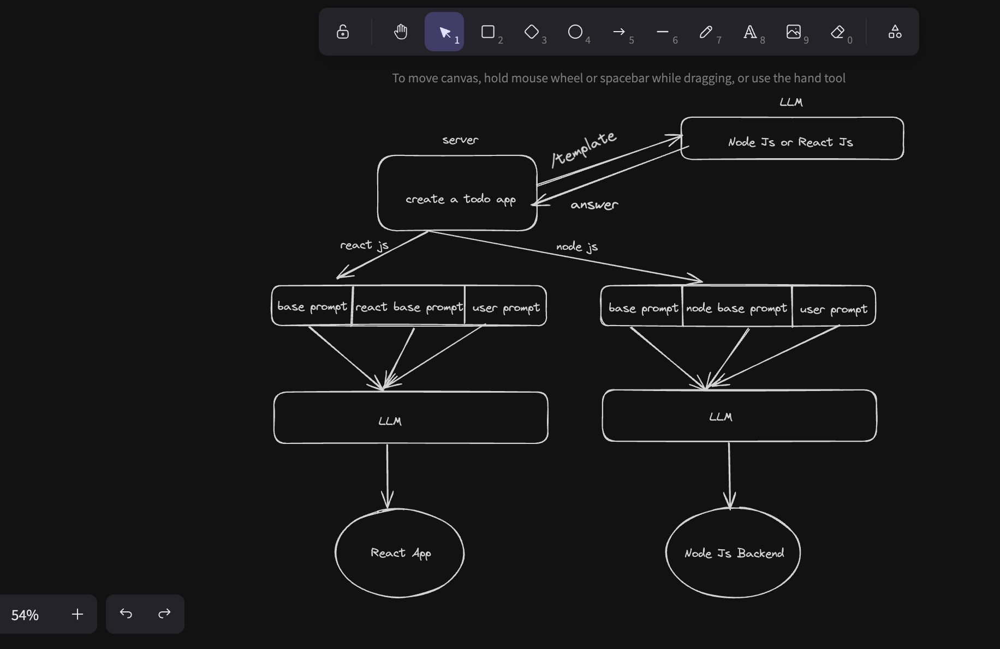

# Blitz-AI

Blitz-AI is an application built with AI-powered content generation, offering a real-time web interface to interact with AI models for various tasks. This project uses **Node.js**, **Express.js**, **Gemini API**, **TypeScript** for the backend, and **Vite**, **React.js**, **Tailwind CSS**, and **Lucide React** for the frontend.

---

## Tech Stack

### Backend:
- **Node.js**: JavaScript runtime environment for building scalable server-side applications.
- **Express.js**: Web framework for building RESTful APIs and handling HTTP requests.
- **Gemini API**: For AI-powered content generation.
- **TypeScript**: Strongly-typed superset of JavaScript.

### Frontend:
- **Vite**: Fast, lightweight build tool for modern web development with React.
- **React.js**: Library for building user interfaces with a component-based architecture.
- **Tailwind CSS**: Utility-first CSS framework for building modern, responsive layouts.
- **Lucide React**: React library for using vector icons in your UI components.

---

## Project Structure

```
Blitz-AI/
│
├── backend/        # Contains the backend code and API
├── frontend/       # Contains the frontend React app
└── docs/           # Contains project structure diagrams in Excalidraw
```

---

## Setup Instructions

### Prerequisites

Before you get started, ensure you have the following installed on your local machine:
- **Node.js** (v18 or higher)
- **npm** (v7 or higher) or **yarn** (for package management)
- **TypeScript** (optional if you're using `ts-node`)

# Basic Project Architecture 
- User gives a prompt 
- Server forwards the prompt to the LLM on /template endpoint
- LLM responds that whether the user prompt is related to Node Js or React Js
- We have a react base prompt,node base prompt . Also we have a basic instruction for the LLM. After response comes from /template endpoint. If the respose is node then we use node js base template or if the response is react we use react js base template . 
- From the response we got from the /template endpoint it returns two messages ,we forward it to the LLM as default 
- With that two responses we include the user prompt,these 3 combines a user prompt
- So base prompt,react/node base prompt,user prompt these sent to the LLM and it starts to create the app based on react or node 




### 1. Clone the Repository

Start by cloning the repository to your local machine:
```bash
git clone https://github.com/Rudra-Sankha-Sinhamahapatra/Blitz-AI.git
cd Blitz-AI
```

### 2. Setup Frontend

The frontend is built using React.js and provides an interactive UI for the user to input prompts and view AI-generated content.

#### 2.1. Install Frontend Dependencies

Navigate to the `frontend` folder:
```bash
cd frontend
```

Install the required dependencies:
```bash
npm install
```

#### 2.2. Configure Backend API URL

To ensure that the frontend can communicate with the backend, you may need to set the backend URL. Create a `.env` file in the `frontend` folder with the following content:
```bash
VITE_BACKEND_URL=http://localhost:5000
```

#### 2.3. Start the Frontend Development Server

Once the dependencies are installed, you can start the frontend development server:
```bash
npm run dev
```

The frontend will now be accessible at `http://localhost:3000`.

### 3. Setup Backend

The backend is responsible for handling API requests, interacting with the Gemini API for content generation, and serving the necessary data to the frontend.

#### 3.1. Install Backend Dependencies

Open a separate terminal window, then navigate to the `backend` folder:
```bash
cd backend
```

Install the required dependencies:
```bash
npm install
```

#### 3.2. Configure Environment Variables

You will need an API key for the Gemini API. Create a `.env` file in the `backend` folder with the following content:
```bash
GEMINI_API_KEY=your-gemini-api-key-here
```

#### 3.3. Start the Backend Server

Once the dependencies are installed and the `.env` file is configured, you can start the backend server:
```bash
npm run dev
```

The backend server will now be running at `http://localhost:5000`.

---

## Full Stack Setup

To run both the backend and frontend simultaneously, follow the steps below:

1. Open one terminal window and navigate to the `backend` folder, then run:
   ```bash
   cd backend
   npm run dev
   ```

2. Open a second terminal window, navigate to the `frontend` folder, then run:
   ```bash
   cd frontend
   npm run dev
   ```

---

## API Endpoints

The backend exposes the following endpoints:

It looks like you're describing an API structure for two endpoints (`/template` and `/chat`) that are part of a system where you interact with a language model (LLM) to get insights and generate code based on user input.

### Flow Summary:

1. **Template Endpoint (`/template`)**:
   - A user sends a prompt like `"create a backend for my habit tracker app"`.
   - The backend communicates with the LLM and returns a response identifying the type of template (e.g., Node.js or React).
   - The LLM response includes `prompts` and `uiPrompts` to guide the user through the generation of the project setup, listing files, and how to execute them.

2. **Chat Endpoint (`/chat`)**:
   - The user sends a prompt that is processed with specific template details returned by the `/template` endpoint.
   - The system responds based on which template was chosen (like Node.js or React) and provides related code prompts and artifacts.

### Example of `/template` Response:
When you call the `/template` endpoint, it processes the prompt like:
```json
{
    "prompt": "create a backend for my habit tracker app"
}
```
The response could be:
```json
{
    "prompts": [
        "Here is an artifact that contains all files of the project visible to you.\nConsider the contents of ALL files in the project...\n<boltArtifact id=\"project-import\" title=\"Project Files\"><boltAction type=\"file\" filePath=\"index.js\">...</boltAction></boltArtifact>"
    ],
    "uiPrompts": [
        "<boltArtifact id=\"project-import\" title=\"Project Files\"><boltAction type=\"file\" filePath=\"index.js\">...</boltAction></boltArtifact>"
    ]
}
```

This response gives a breakdown of files that the user can interact with to set up their project.

### Example of `/chat` Request:
For the `/chat` endpoint, you have a more complex structure where the user might give multiple pieces of input. The request body could look like this:
```json
{
    "messages": [
        {
            "role": "user",
            "parts": [
                {
                    "text": "For all designs I ask you to make, have them be beautiful, not cookie cutter. Make webpages that are fully featured and worthy for production."
                }
            ]
        },
        {
            "role": "user",
            "parts": [
                {
                    "text": "Here is an artifact that contains all files of the project visible to you..."
                }
            ]
        }
    ]
}
```

The response could be:
```json
{
    "response": "Here's a plan to build a habit tracker app using Vite, React, and TypeScript.  This will be a single-page application for simplicity, focusing on core functionality.  A production-ready app would require more robust features (e.g., authentication, persistent storage, data backup/restore) and thorough testing.\n\n<boltArtifact id=\"habit-tracker-app\" title=\"Habit Tracker App\">\n  <boltAction type=\"file\" filePath=\"package.json\">\n```json\n{\n  \"name\": \"habit-tracker\",\n  \"private\": true,\n  \"version\": \"0.0.1\",\n  \"type\": \"module\",\n  \"scripts\": {\n    \"dev\": \"vite\",\n    \"build\": \"vite build\",\n    \"preview\": \"vite preview\"\n  },\n  \"dependencies\": {\n    \"lucide-react\": \"^0.344.0\",\n    \"react\": \"^18.3.1\",\n    \"react-dom\": \"^18.3.1\",\n    \"date-fns\": \"^2.30.0\"\n  },\n  \"devDependencies\": {\n    \"@eslint/js\": \"^9.9.1\",\n    \"@types/react\": \"^18.3.5\",\n    \"@types/react-dom\": \"^18.3.0\",\n    \"@types/date-fns\": \"^2.30.0\",\n    \"@vitejs/plugin-react\": \"^4.3.1\",\n    \"autoprefixer\": \"^10.4.18\",\n    \"eslint\": \"^9.9.1\",\n    \"eslint-plugin-react-hooks\": \"^5.1.0-rc.0\",\n    \"eslint-plugin-react-refresh\": \"^0.4.11\",\n    \"globals\": \"^15.9.0\",\n    \"postcss\": \"^8.4.35\",\n    \"tailwindcss\": \"^3.4.1\",\n    \"typescript\": \"^5.5.3\",\n    \"typescript-eslint\": \"^8.3.0\",\n    \"vite\": \"^5.4.2\"\n  }\n}\n```\n  </boltAction>\n  <boltAction type=\"shell\">\n```bash\nnpm install\n```\n  </boltAction>\n  <boltAction type=\"file\" filePath=\"src/App.tsx\">\n```tsx\nimport React, { useState } from 'react';\nimport { AddHabitForm } from './components/AddHabitForm';\nimport { HabitList } from './components/HabitList';\nimport { format } from 'date-fns';\n\ninterface Habit {\n  id: string;\n  name: string;\n  completed: boolean[]; // Array to track completion for each day\n}\n\n\nfunction App() {\n  const [habits, setHabits] = useState<Habit[]>([]);\n  const currentDate = new Date();\n  const formattedDate = format(currentDate, 'yyyy-MM-dd');\n\n  const addHabit = (newHabit: Omit<Habit, 'completed'>) => {\n    const newHabitWithCompleted = {\n      ...newHabit,\n      completed: Array(7).fill(false), // Initialize completion array with 7 days\n    };\n      setHabits([...habits, newHabitWithCompleted]);\n  };\n\n  const toggleHabitCompletion = (habitId: string, dayIndex: number) => {\n    setHabits((prevHabits) =>\n      prevHabits.map((habit) =>\n        habit.id === habitId\n          ? {\n              ...habit,\n              completed: habit.completed.map((completed, index) =>\n                index === dayIndex ? !completed : completed\n              ),\n            }\n          : habit\n      )\n    );\n  };\n\n  return (\n    <div className=\"container mx-auto p-4\">\n      <h1 className=\"text-3xl font-bold mb-4\">Habit Tracker</h1>\n      <AddHabitForm addHabit={addHabit} />\n      <HabitList\n        habits={habits}\n        currentDate={formattedDate}\n        toggleHabitCompletion={toggleHabitCompletion}\n      />\n    </div>\n  );\n}\n\nexport default App;\n```\n  </boltAction>\n  <boltAction type=\"file\" filePath=\"src/components/AddHabitForm.tsx\">\n```tsx\nimport React, { useState } from 'react';\nimport { v4 as uuidv4 } from 'uuid';\n\ninterface AddHabitFormProps {\n  addHabit: (habit: { id: string; name: string }) => void;\n}\n\nexport const AddHabitForm: React.FC<AddHabitFormProps> = ({ addHabit }) => {\n  const [habitName, setHabitName] = useState('');\n\n  const handleSubmit = (e: React.FormEvent) => {\n    e.preventDefault();\n    if (habitName.trim() !== '') {\n      addHabit({ id: uuidv4(), name: habitName });\n      setHabitName('');\n    }\n  };\n\n  return (\n    <form onSubmit={handleSubmit} className=\"mb-4\">\n      <input\n        type=\"text\"\n        placeholder=\"Add a new habit\"\n        value={habitName}\n        onChange={(e) => setHabitName(e.target.value)}\n        className=\"border border-gray-300 rounded px-3 py-2 mr-2 focus:outline-none focus:ring-2 focus:ring-blue-500\"\n      />\n      <button\n        type=\"submit\"\n        className=\"bg-blue-500 hover:bg-blue-700 text-white font-bold py-2 px-4 rounded focus:outline-none focus:shadow-outline\"\n      >\n        Add Habit\n      </button>\n    </form>\n  );\n};\n```\n  </boltAction>\n  <boltAction type=\"file\" filePath=\"src/components/HabitList.tsx\">\n```tsx\nimport React from 'react';\nimport { Habit } from '../App';\nimport { format, addDays } from 'date-fns';\n\ninterface HabitListProps {\n  habits: Habit[];\n  currentDate: string;\n  toggleHabitCompletion: (habitId: string, dayIndex: number) => void;\n}\n\nexport const HabitList: React.FC<HabitListProps> = ({\n  habits,\n  currentDate,\n  toggleHabitCompletion,\n}) => {\n  const days = Array.from({ length: 7 }, (_, i) =>\n    format(addDays(new Date(currentDate), i), 'EEE dd')\n  );\n\n  return (\n    <table className=\"w-full table-auto border-collapse\">\n      <thead>\n        <tr>\n          <th className=\"p-2 border border-gray-300\">Habit</th>\n          {days.map((day) => (\n            <th key={day} className=\"p-2 border border-gray-300\">{day}</th>\n          ))}\n        </tr>\n      </thead>\n      <tbody>\n        {habits.map((habit) => (\n          <tr key={habit.id}>\n            <td className=\"p-2 border border-gray-300\">{habit.name}</td>\n            {habit.completed.map((completed, index) => (\n              <td key={`${habit.id}-${index}`} className=\"p-2 border border-gray-300\">\n                <input\n                  type=\"checkbox\"\n                  checked={completed}\n                  onChange={() => toggleHabitCompletion(habit.id, index)}\n                  className=\"cursor-pointer\"\n                />\n              </td>\n            ))}\n          </tr>\n        ))}\n      </tbody>\n    </table>\n  );\n};\n```\n  </boltAction>\n  <boltAction type=\"file\" filePath=\"src/index.css\">\n```css\n@tailwind base;\n@tailwind components;\n@tailwind utilities;\n```\n  </boltAction>\n  <boltAction type=\"file\" filePath=\"src/main.tsx\">\n```tsx\nimport { StrictMode } from 'react';\nimport { createRoot } from 'react-dom/client';\nimport App from './App';\nimport './index.css';\n\ncreateRoot(document.getElementById('root')!).render(\n  <StrictMode>\n    <App />\n  </StrictMode>\n);\n\n```\n  </boltAction>\n  <boltAction type=\"file\" filePath=\"tailwind.config.js\">\n```javascript\n/** @type {import('tailwindcss').Config} */\nmodule.exports = {\n  content: [\"./index.html\", \"./src/**/*.{js,ts,jsx,tsx}\"],\n  theme: {\n    extend: {},\n  },\n  plugins: [],\n}\n```\n  </boltAction>\n  <boltAction type=\"shell\">\n```bash\nnpm run dev\n```\n  </boltAction>\n</boltArtifact>\n\nThis creates a basic habit tracker.  You can add, view, and track the completion of habits across a week.  Remember to run `npm install` before `npm run dev`.  Enhancements could include:\n\n*   **Persistence:** Use local storage or a backend to save habits across sessions.\n*   **Styling:** Improve the UI with more sophisticated styling and potentially a UI library.\n*   **Error Handling:** Add error handling for various scenarios.\n*   **Advanced Features:** Consider features like streak tracking, statistics, habit editing/deletion, and more.\n\n"
}
```

---

## Documentation

The `docs` folder contains project structure diagrams created with Excalidraw. These diagrams help visualize the architecture and components of the project, making it easier to understand the design and flow of the system.

- Install the Excalidraw extension on VS Code to access the docs
- Here is a basic structure about the Project Architecture
---

## Contributing

If you'd like to contribute to this project, feel free to fork the repository and submit a pull request. When contributing, please follow these guidelines:
- Write clear and concise commit messages.
- Ensure that all code is properly formatted.
- Add tests for any new functionality or bug fixes.

For feature requests or issues, please open a GitHub issue.

---

## License

This project is licensed under the [MIT License](LICENSE).
